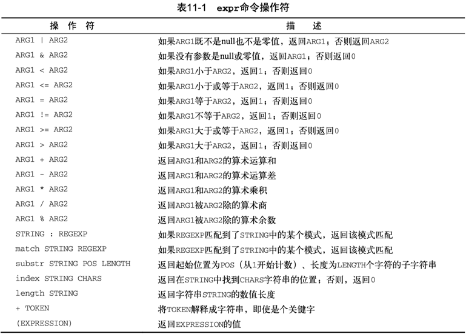

## 运算表达式

[Difference between let, expr and $[]](https://askubuntu.com/questions/939294/difference-between-let-expr-and)

命令行执行运算表达式：

```sh
$ expr 5 + 1
6

$ $(expr 5 + 1)
zsh: command not found: 6

$ $[5 + 1]
zsh: command not found: 6

$ $((5+1))
zsh: command not found: 6
```

> 如果想在命令行执行数学计算，建议使用数学计算器 `bc`（bash calculator）。

在 bash shell 脚本中有以下几种运算表达式的书写方式。

### expr

最开始，Bourne shell 提供了一个特别的命令用来处理数学表达式。
expr 命令允许在命令行上处理数学表达式，但是特别笨拙。

expr 命令能够识别少数的数学和字符串操作符，见表11-1。



需要注意两点：

1. 操作符两侧需要空格隔开算子；  
2. 算子引用变量需要用美元符号；  

```sh
$ x=$(expr 5 + 1)
$ echo $x
6

#星号需要转义

$ y=`expr 5 \* 2`
$ echo $y
10
```

可用 expr 表达式实现 for 循环中记录递增的索引：

```sh
$ i=0
$ index=`expr $i + 1` # 等效于 index=$(expr $i + 1)
$ echo $i $index
0 1
```

综合示例2：

```sh
#!/bin/bash

$ var1=5
$ var2=1
$ x=$var1+$var2
$ echo "x=$x"
x=5+1

$ y=$(expr $var1+$var2)
$ echo "y=$y"
y=5+1

$ z=$(expr $var1 + $var2)
$ echo "z=$z"
z=6
```

前两种运算符与算子之间没有空格，被当成了字符串拼接。
第三种是正确的 expr 算术表达式写法，结果符合预期。

### $[]

bash shell 为了保持跟 Bourne shell 的兼容而包含了 expr 命令，但同时提供了一种更简单的方法来执行数学表达式。
在 bash 中，在将一个数学运算结果赋给某个变量时，可以用美元符号和方括号（`$[operation]`）将数学表达式围起来。

用方括号执行shell数学运算比用expr命令方便很多。

1. 操作符两侧非必须要用空格隔开算子；  
2. 算子可直接引用变量，可无需美元符号；  

常量计算表达式：

```sh
$ x=$[5 + 1]
$ echo $x
6

$ y=$[5*2]
$ echo $y
10
```

用 `$[]` 表达式实现 for 循环中记录递增的索引：

```sh
$ i=0
$ index=$[$i+1]
$ echo $i $index
0 1
```

变量计算表达式：

```sh
$ var1=5
$ var2=1

$ x=$[var1 + var2]
$ echo "x=$x"
x=6
```

在使用方括号来计算公式时，不用担心shell会误解乘号或其他符号。  
对于方括号中的星号，shell知道它执行数学中的乘法运算而不是通配符，因为它在方括号内。

```sh
$ var1=100
$ var2=50
$ var3=45
$ # var4=$[$var1 * ($var2 - $var3)]
$ var4=$[var1*(var2-var3)] # 简写
$ echo The final result is $var4
The final result is 500
```

无论是 expr 表达式，还是中括号运算式，bash shell 数学运算符只支持整数运算。

```sh
$ var1=100
$ var2=45
$ var3=$(expr $var1 / $var2)
$ echo The final result is $var3
2
$ var4=$[var1/var2]
$ echo The final result is $var4
2
```

如果需要在shell脚本中进行浮点数运算，可以考虑看看 z shell，zsh 提供了完整的浮点数算术操作。  
也可将表达式重定向到 bash 内置计算器 `bc` 做计算，参考 REDIRECTION 相关议题。

### let

`let` command performs arithmetic evaluation and is a shell built-in.

bash shell 内置支持的 let 表达式，直接引用变量，而无需美元符号解引用，更接近于 C 等现代编程语言里面的自然表达式。

范式：`let var3=var1+var2`

```sh
$ z=0
$ let z=z+3 # 等效: let z+=3
$ let "z += 3"
$ echo "z = $z"
6

$ let 'sum=10+1'
$ echo "sum = $sum"
sum = 11
```

综合示例：

```sh
$ var1=5
$ var2=1
$ let x=var1+var2
$ echo "x=$x"
x=6

$ let "y=var1+var2"
$ echo "y=$y"
y=6
```

let 表达式更自然，算子引用的变量直接采用变量名，无需添加美元符号，推荐使用。

以下用 `let` 表达式实现 for 循环中记录递增的索引：

```sh
$ i=0
$ let index=i+1
$ echo $i $index
0 1

$ let i++
$ echo $i
1

$ let i+=1
$ echo $i
2

$ let index=i++
$ echo $i $index
3 2

$ let index=++i
$ echo $i $index
4 4
```

### (())

test 命令只能在比较中使用简单的算术操作。
双括号命令允许你在比较过程中使用高级数学表达式。
双括号命令提供了更多的数学符号，这些符号对于用过其他编程语言的程序员而言并不陌生。

双括号命令的格式如下：

```sh
(( expression ))
```

双括号表达式，实际上等效于 let 表达式。

> This is exactly equivalent to `let` "expression"

表12-4列出了双括号命令中会用到的其他运算符：


可以在if语句中用双括号命令，也可以在脚本中的普通命令里使用来赋值。

```sh
#!/bin/bash

n=0
(( n += 1 )) #Increment
echo "n = $n"

val1=10

if (( $val1 ** 2 > 90 ))
then (( val2 = $val1 ** 2 ))
    echo "The square of $val1 is $val2"
fi
```

双括号内的算式中，解引用变量时可不添加美元符号。

> Within double parentheses, parameter dereferencing is optional.

关于双括号的场景，参考bash中C语言风格的for循环格式：

```sh
for (( variable assignment ; condition ; iteration process ))

#实例

for (( a = 1; a < 10; a++ ))
```

注意，有些部分并没有遵循bash shell标准的for命令：

- 变量赋值可以有空格  
- 条件中的变量不以美元符开头  
- 迭代过程的算式未用expr命令格式。  

#### arithexp

[Arithmetic Expansion](https://www.tldp.org/LDP/abs/html/arithexp.html)

```sh
# man bash
   Arithmetic Expansion
       Arithmetic expansion allows the evaluation of an arithmetic expression and the substitu-
       tion of the result.  The format for arithmetic expansion is:

              $((expression))

       The  expression is treated as if it were within double quotes, but a double quote inside
       the parentheses is not treated specially.  All tokens in the expression undergo  parame-
       ter  expansion,  string  expansion, command substitution, and quote removal.  Arithmetic
       expansions may be nested.

       The evaluation is performed according to the rules listed below under ARITHMETIC EVALUA-
       TION.  If expression is invalid, bash prints a message indicating failure and no substi-
       tution occurs.
```

示例：

```sh
#!/bin/bash

val3=$((val2+3))
#val3=$(($val2+3)) #Also correct

echo "val3=$val3"
```

双重括号表达式基本上和 let 表达式等效。

以下用 `(( expr ))` 表达式实现 for 循环中记录递增的索引：

```sh
$ i=0
$ ((i += 1))
$ echo $i
1

$ index=$((i+1))
$ echo $i $index
1 2
```
