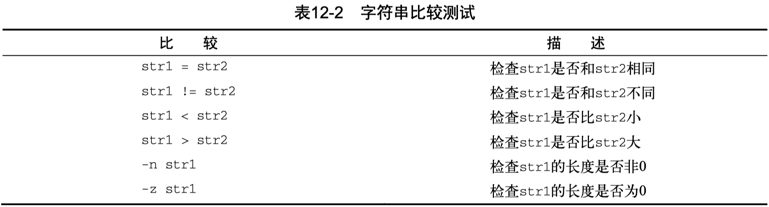

到目前为止，在if语句中看到的都是普通shell命令。
你可能想问，if-then语句是否能测试命令退出状态码之外的条件呢？
答案是不能。但在bash shell中有个好用的工具可以帮你通过if-then 语句测试其他条件。

test命令提供了在if-then语句中测试不同条件的途径。

1. 如果test命令中列出的条件成立，test命令就会退出并返回退出状态码0。这样if-then语句就与其他编程语言中的if-then语句以类似的方式工作了。  
2. 如果条件不成立，test命令就会退出并返回非零的退出状态码，这使得 if-then语句不会再被执行。  

test命令的格式非常简单。

```
test condition
```

condition是test命令要测试的一系列参数和值。

当用在if-then语句中时，test命令看起来是这样的：

```
if test condition
then
    commands
fi
```

## 方括号

bash shell 提供了另一种条件测试方法，无需在 if-then 语句中声明 test 命令。

```Shell
if [ condition ]
then
    commands
fi
```

**方括号** 定义了测试条件。

注意，第一个方括号之后和第二个方括号之前必须加上一个空格，否则就会报错。

test 命令可以判断三类条件：

1. 数值比较  
2. 字符串比较  
3. 文件比较  

### 数值比较

使用 test 命令最常见的情形是对两个数值进行比较。数值条件测试可以用在数字和变量上。


### 字符串比较

条件测试还允许比较字符串值。比较字符串比较烦琐，你马上就会看到。



### 文件比较

最后一类比较测试很有可能是 shell 编程中最为强大、也是用得最多的比较形式。它允许你测试 Linux 文件系统上文件和目录的状态。


---

[Check if a directory exists in a shell script](https://stackoverflow.com/questions/59838/check-if-a-directory-exists-in-a-shell-script)  

[Linux / UNIX: Find Out If a Directory Exists or Not](https://www.cyberciti.biz/tips/find-out-if-directory-exists.html)  

当前目录下如果有 `forms-debug` 文件夹则进入，否则先创建再进入。

```Shell
([ -d forms-debug ] || mkdir forms-debug) && cd forms-debug
```

> 括号的使命令列表变成了进程列表，生成了一个子shell来执行对应的命令。

### 复合条件测试

if-then 语句允许你使用布尔逻辑来组合测试。有两种布尔运算符可用：

- [ condition1 ] && [ condition2 ]  
- [ condition1 ] || [ condition2 ]  

第一种布尔运算使用 AND 布尔运算符来组合两个条件。要让 then 部分的命令执行，两个条件都必须满足。  
第二种布尔运算使用 OR 布尔运算符来组合两个条件。如果任意条件为 TRUE，then 部分的命令就会执行。  

## if-then 的高级特性

bash shell 提供了两项可在 if-then 语句中使用的高级特性：

- 用于数学表达式的双括号  
- 用于高级字符串处理功能的双方括号  

### 双括号

双括号命令允许你在比较过程中使用高级数学表达式。

双括号命令的格式如下：`(( expression ))`

expression 可以是任意的数学赋值或比较表达式。除了test命令使用的标准数学运算符，还支持其他运算符。  
可以在if语句中用双括号命令，也可以在脚本中的普通命令里使用来赋值。  


### 双方括号

双方括号命令提供了针对字符串比较的高级特性。

双方括号命令的格式如下：`[[ expression ]]`

双方括号里的expression使用了test命令中采用的标准字符串比较。但它提供了test命令未提供的另一个特性——**模式匹配**（pattern matching）。

在模式匹配中，可以定义一个正则表达式来匹配字符串值。

```Shell
#!/bin/bash
# using pattern matching
#

if [[ $USER == r* ]]
then
    echo "Hello $USER"
else
    echo "Sorry, I do not know you"
fi
```

双等号（`==`）将右边的字符串（`r*`）视为一个模式，并应用模式匹配规则。

另外一种写法是利用 `=~` 判断匹配包含关系。

```Shell
strA="helloworld"
strB="low"
if [[ $strA =~ $strB ]]
then
    echo "包含"
else
    echo "不包含"
fi
```

命令行测试：

```
➜  ~ strA="helloworld"
➜  ~ strB="low"
➜  ~ if [[ $strA == *low* ]] ; then echo "包含" ; else echo "不包含" ; fi
包含
➜  ~ if [[ $strA =~ $strB ]] ; then echo "包含" ; else echo "不包含" ; fi
包含
```
