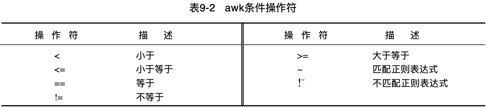

```
pattern { action }
```

`pattern` 可为逻辑运算表达式或正则表达式。

```
$ cat grade.txt
M.Tansley   05/99   48311   Green       8   40  44
J.Lulu      06/99   48317   green       9   24  26
P.Bunny     02/99   48      Yellow      12  35  28
J.Troll     07/99   4842    Brown-3     12  26  26
L.Tansley   05/99   4712    Brown-2     12  30  28
```



## 域匹配

为使一域号匹配正则表达式，使用符号 `~` 后紧跟正则表达式。
也可以用 if 语句，if 后面的条件用 `()` 括起来。

```
$ awk '{if($4~/Brown/) print $0}' grade.txt
J.Troll     07/99   4842    Brown-3     12  26  26
L.Tansley   05/99   4712    Brown-2     12  30  28
```

根据 `pattern { action }` 的语法，可以改写为标准范式：

```
awk '$4~/Brown/{print $0}' grade.txt
```

缺省情况下，awk 将打印所有匹配记录，可以省略动作部分，进一步简写如下：

```
awk '$4~/Brown/' grade.txt
```

假定要使字符串精确匹配，比如说查看学生序号 48，文件中有许多学生序号包含 48。
如果在 field-3 中查询序号48，awk 将返回所有序号带48的记录：

```
# awk '{if($3~/48/) print $0}' grade.txt
# awk '$3~/48/{print $0}' grade.txt
$ awk '$3~/48/' grade.txt
M.Tansley   05/99   48311   Green       8   40  44
J.Lulu      06/99   48317   green       9   24  26
P.Bunny     02/99   48      Yellow      12  35  28
J.Troll     07/99   4842    Brown-3     12  26  26
```

为了精确匹配，需要使用 `==` 判断：

```
# awk '{if($3=="48") print $0}' grade.txt
# awk '$3=="48"{print $0}' grade.txt
$ awk '$3=="48"' grade.txt
P.Bunny     02/99   48      Yellow      12  35  28
```

---

有时要浏览信息并抽取不匹配操作的记录，与 `~` 相反的符号是 `!~`， 意即不匹配。  

只对 field-4 进行不匹配操作，方法如下：

```
$ awk '$4!~/Brown/' grade.txt
```

如果想要查询非 Brown-2 的腰带级别，可使用  `!=` 判断：

```
$ awk '$4!="Brown-2"' grade.txt
```

### 多行划分区块

考虑工程根目录下有以下 code owner 的 CR 配置文件 `bak.code.yml`：

```
- path: /Classes/ui/DeviceMgr/PrinterTableView.h
  owners:
  - zhangsan
  - lisi
  - wangwu
  owner_rule: 1
- path: /Classes/ui/DeviceMgr/PrinterTableView.m
  owners:
  - zhangsan
  - lisi
  - wangwu
  owner_rule: 1
- path: /Classes/ui/DeviceMgr/PrinterDeviceCell.h
  owners:
  - zhangsan
  - lisi
  - wangwu
  owner_rule: 1
- path: /Classes/ui/DeviceMgr/PrinterDeviceCell.m
  owners:
  - zhangsan
  - lisi
  - wangwu
  owner_rule: 1
```

执行以下 sed 语句可以界定目录 `/Classes/ui/DeviceMgr/` 的 CR 匹配规则块记录：

```
$ sed -n '/- path: \/Classes\/ui\/DeviceMgr\//,/owner_rule/p' bak.code.yml
```

考虑用 awk 等效实现，可以以 `- path: ` 作为记录分割符，以 `\n` 作为字段分割符，匹配打印结果如下：

```
$ awk 'BEGIN {RS="- path: "; FS="\n"; ORS=""} $1~/\/Classes\/ui\/DeviceMgr\//' bak.code.yml
/Classes/ui/DeviceMgr/PrinterTableView.h
  owners:
  - zhangsan
  - lisi
  - wangwu
  owner_rule: 1
/Classes/ui/DeviceMgr/PrinterTableView.m
  owners:
  - zhangsan
  - lisi
  - wangwu
  owner_rule: 1
/Classes/ui/DeviceMgr/PrinterDeviceCell.h
  owners:
  - zhangsan
  - lisi
  - wangwu
  owner_rule: 1
/Classes/ui/DeviceMgr/PrinterDeviceCell.m
  owners:
  - zhangsan
  - lisi
  - wangwu
  owner_rule: 1
```

默认的输出记录分割符为换行符，输出记录之间有空行。设置了 `ORS=""` 后，输出记录之间无空行。

以上输出可以看到，块记录的第1行缺少分隔符 RS 前缀，考虑补上：

```
awk 'BEGIN {RS="- path: "; FS="\n"; ORS=""; OFS="\n"}
    $1~/\/Classes\/ui\/DeviceMgr\//{
        $1="- path: "$1;
        print $0
    }' bak.code.yml
```

> 思考：如何进一步基于 awk 命令移除这些匹配的 CR 规则区块记录呢？

## 记录匹配

表达式 `$0 ~/Brown/`，意即查询包含模式 Brown 腰带级别的记录并打印它；  
表达式 `$0 !~/Brown/`，意即查询不包含模式 Brown 腰带级别的记录并打印它；  

```
$ awk '$0~/Brown/' grade.txt
J.Troll     07/99   4842    Brown-3     12  26  26
L.Tansley   05/99   4712    Brown-2     12  30  28

$ awk '$0!~/Brown/' grade.txt
M.Tansley   05/99   48311   Green       8   40  44
J.Lulu      06/99   48317   green       9   24  26
P.Bunny     02/99   48      Yellow      12  35  28
```

对于整条记录而非某个域字段进行匹配时，可以省略 `$0` 不写。

1. 匹配记录：`awk '/Brown/' grade.txt`  
2. 不匹配记录：`awk '!/Brown/' grade.txt`  

### 过滤行区间

要打印出从 M 行到 N 行这个范围内的文本内容，可使用下面的语法：

```
$ awk 'NR==M, NR==N' filename
```

也可以用stdin作为输入：

```
$ cat filename | awk 'NR==M, NR==N'
```

以下筛选打印文件 grade.txt 的第2~4行：

```
$ #awk 'NR==2, NR==4' grade.txt
$ awk 'FNR==2, FNR==4' grade.txt
J.Lulu      06/99   48317   green       9   24  26
P.Bunny     02/99   48      Yellow      12  35  28
J.Troll     07/99   4842    Brown-3     12  26  26
```

### 模式匹配区间

要打印处于 start_pattern 与 end_pattern 之间的文本，可使用下面的语法：

```
$ awk '/start_pattern/, /end _pattern/' filename
```

例如，筛选打印 .code.yml 中目录 `/Classes/ui/DeviceMgr/` 的 CR 匹配规则块记录：

```
$ awk '/- path: \/Classes\/ui\/DeviceMgr\//,/owner_rule/' bak.code.yml
```

等价的 sed 表达式如下：

```
$ sed -n '/- path: \/Classes\/ui\/DeviceMgr\//,/owner_rule/p' bak.code.yml
```

## 任意字符

抽取名字，其记录第一域的第四个字符是 a，使用句点 `.` 表示任意字符。  
表达式 `/^...a/` 意为行首前三个字符任意，第四个是a，尖角符号代表行首。  

```
$ awk '$1 ~/^...a/' grade.txt
M.Tansley   05/99   48311   Green       8   40  44
L.Tansley   05/99   4712    Brown-2     12  30  28
```

## 候选字符

在测试正则表达式时提到可匹配 `[]` 内任意字符或单词，因此若查询文件中级别为 green的所有记录，不论其大小写，表达式应为 `/[Gg]reen/`。

```
$ awk '/[Gg]reen/' grade.txt
M.Tansley   05/99   48311   Green       8   40  44
J.Lulu      06/99   48317   green       9   24  26
```

## 或关系匹配

为抽取级别为 Yellow 或 Brown 的记录，使用竖线符（`|`），意为匹配 `|` 两边模式之一。  
注意：使用竖线符时，语句必须用圆括号括起来。

```
$ awk '/(Yellow|Brown)/' grade.txt
P.Bunny     02/99   48      Yellow      12  35  28
J.Troll     07/99   4842    Brown-3     12  26  26
L.Tansley   05/99   4712    Brown-2     12  30  28
```

## 与或条件

与条件关系：

```
# awk '{if($1=="P.Bunny" && $4=="Yellow") print $0}' grade.txt
# awk '$1=="P.Bunny" && $4=="Yellow" {print $0}' grade.txt
$ awk '$1=="P.Bunny" && $4=="Yellow"' grade.txt
P.Bunny     02/99   48      Yellow      12  35  28
```

或条件关系：

```
# awk '{if($4=="Yellow" || $4~/Brown/) print $0}' grade.txt
# awk '$4=="Yellow" || $4~/Brown/ {print $0}' grade.txt
$ awk '$4=="Yellow" || $4~/Brown/' grade.txt
P.Bunny     02/99   48      Yellow      12  35  28
J.Troll     07/99   4842    Brown-3     12  26  26
L.Tansley   05/99   4712    Brown-2     12  30  28
```
