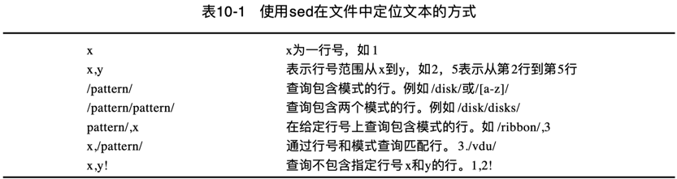

shell 脚本最常见的一个用途就是处理文本文件。检查日志文件、读取配置文件、处理数据元素，shell 脚本可以帮助我们将文本文件中的各种数据的日常处理任务自动化。

对于日常工作中的文本编辑需求，可以选择 vscode 这种 GUI 客户端或 vim 这种 CUI 客户端进行操作，
vscode 和 vim 这两种编辑器，都支持通过鼠标或键盘来完成交互式编辑工作。

有时候需要自动处理（编辑）文本文件，但是又不想动用全副武装的交互式文本编辑器。此时，需要一个能够实现自动格式化、插入、修改或删除文本元素的简单命令行编辑器。

Unix/Linux 世界，提供了两个广泛使用的命令行编辑器：`sed` 和 `awk`。

## sed

sed（`s`tream `ed`itor）意即流式编辑器，和普通的交互式文本编辑器恰好相反。
流式编辑器基于预先提供的一组规则命令来操作数据流，实现无交互静默编辑。

1. **流** 可以是管道重定向的 STDIN，也可以是文件。  
2. **规则** 要么从命令行中输入，要么存储在一个脚本文件中。  

sed 流编辑器的基本处理单位是 **行**，即按顺序逐行处理。  
在流编辑器将所有命令与一行数据匹配完毕后，会读取下一行数据并重复这个过程，直至处理完流中的所有数据行。  

sed 编辑器一般会执行下列操作：

1. 一次从输入中读取一行数据；  
2. 根据所提供的编辑器命令匹配数据；  
3. 按照命令修改（编辑）流中的数据；  
4. 将编辑后的新的数据输出到 STDOUT。  

需要明白的是，sed 编辑器并不会修改原始文本文件的内容。
它只是将修改后的数据发送到 STDOUT，原始文本文件依然保留着原始数据。

> 如果要回写原始文件，可以开启 `-i` 选项。

### format

sed 命令的一般格式如下：

```
sed options command-script input-file
```

### options

sed 主要有5个常用命令选项：

选项         | 描述
------------|------------------------------------------------
`-n`        | 不产生命令输出，使用 print 命令来完成输出
`-e script` | 在处理输入中，将 script 中指定的命令添加到已有的命令中
`-f file`   | 在处理输入中，将 file 中指定的命令添加到已有的命令中
`-E`(`-r`)  | 支持扩展型正则表达式（ERE）
`-i`        | 编辑完回写

### match

默认情况下，在 sed 编辑器中使用的命令会作用于文本数据的所有行。
如果只想将命令作用于特定行或某些行，则必须进行行寻址（line addressing）。

sed 在文件中查询文本的方式有两种：

1. 以数字形式标示行（区间）；  
2. 使用文本模式来过滤出行；  



行号和模式可以混合界定区间：

- `/pattern/, line_number`: 匹配模式到指定行区间；  
- `line_number, /pattern/`: 指定行到匹配模式区间；  

### edit

sed 提供了以下编辑命令：


## basic

不指定 input-file 的默认情况下，sed 编辑器会将指定的命令应用到 STDIN 输入流上。  
这样，可以直接将数据通过管道输入 sed 编辑器处理。  

### 在命令行定义编辑器命令

以下命令过滤打印 file.txt 文件中指定行：

```
# 打印第2行
$ sed -n '2p' file.txt

# 打印末尾行
$ sed -n '$p' file.txt

# 打印整个文件
$ sed -n '1,$p' file.txt
```

更进一步：过滤出 input-file.txt 文件中指定范围的行到 output-file.txt 文件。

```
$ sed -n '100,199p' input-file.txt > output-file.txt
```

或使用 `w` 写入命令：

```
$ sed -n '100,199w output-file.txt' input-file.txt
```

---

以下命令过滤打印 git 冲突文件中 ours 部分：

```
$ sed -n '/^<<<<<<< HEAD$/,/^=======$/p' Git-Conflict.h
```

以下命令过滤打印 git 冲突文件中 theirs incoming 结尾分隔行（形如 `>>>>>>> origin/master`）：

```
$ sed -n '/^>>>>>>> /p' Git-Conflict.h
```

以下命令过滤打印 git 冲突文件中 theirs 部分：

```
$ sed -n '/^=======$/,/^>>>>>>> /p' Git-Conflict.h
```

`svn log -v | sed -n '/fan/,/-----$/ p'`

### 在命令行使用多个编辑器命令

命令之间必须用分号（`;`）隔开，并且在命令末尾和分号之间不能有空格。

以下示例打印第2行的行号，然后打印第2行的内容：

```
$ sed -n '2=; 2p' detail.txt
```

也可用 `-e` 选项依次逐条输入：

```
$ sed -n -e '2=' -e '2p' detail.txt
```

在单行上执行多条命令，可以考虑用花括号将多条命令组合在一起：

```
sed -n '2{=;p}' detail.txt
```

但是 macOS 上不支持这种区块代码在一行执行：

```
$ sed -n '2{=;p}' detail.txt
sed: 1: "2{=;p}": extra characters at the end of p command
```

需要在 p 命令处换行：换行后会出现 *次提示符*（`qoute> `） ，输入将闭合大括号及封尾单引号，最后输入处理文件参数，换行执行。

```
$ sed -n '2{=;p
quote> }' detail.txt

# 或者这样写

$ sed -n '2{
quote> =
quote> p
quote> }' detail.txt
```

必须要记住，要在封尾单引号所在行结束命令。
bash shell 命令一旦发现了封尾的单引号，就会执行命令。
开始执行后，sed 命令就会将你指定的每条命令应用到文本文件的每一行上。

也可直接将写好的跨行代码块整体复制粘贴到命令行执行，不用在命令行逐行输入：

```
sed -n '2{=;p
    }' detail.txt

# 或者这样写

sed -n '2{
    =
    p
}' detail.txt
```

如果不指定行，默认对数据流逐行处理。以下逐行打印行号和内容：

```
$ sed -n '{
    =
    p
}' detail.txt
```

### 从文件中读取编辑器命令

如果有大量要处理的 sed 命令，那么可以将它们放进一个单独的脚本文件中。
sed 命令通过 `-f` 选项来指定从脚本文件读取命令执行。

```
$ cat script1.sed
s/brown/green/
s/fox/elephant/
s/dog/cat/

$ sed -f script1.sed detail.txt
The quick green elephant jumps over the lazy cat.
The quick green elephant jumps over the lazy cat.
The quick green elephant jumps over the lazy cat.
The quick green elephant jumps over the lazy cat.
```

在脚本文件中，不必在每条命令后面添加一个分号。sed 编辑器知道每行都是一条独立的命令。

#### shebang

也可考虑在 sed 脚本开头添加 Shebang 标示脚本语言执行命令。

macOS: `#!/usr/bin/sed -f`  
linux: `#!/bin/sed -f`  

> 具体执行 `which sed` 查看 sed 命令位置。

这样，就可以直接像执行 shell 脚本一样，这样书写：

```
$ chmod u+x script1.sed

$ ./script1.sed detail.txt
The quick green elephant jumps over the lazy cat.
The quick green elephant jumps over the lazy cat.
The quick green elephant jumps over the lazy cat.
The quick green elephant jumps over the lazy cat.
```
